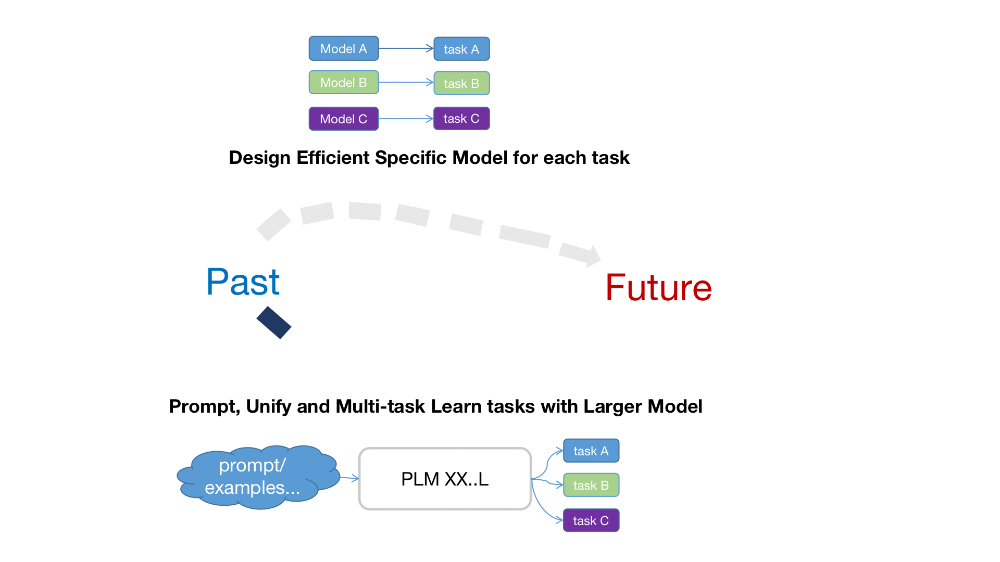

# Introduction to Structured Knowledge Grounding
{: .no_toc }

## Table of contents
{: .no_toc .text-delta .fs-4 style="font-weight:800"}

- TOC
{:toc}

---
## What is structured knowledge?
Structured knowledge(e.g., web tables, knowledge graphs, and databases) stores large amounts of data in an organized structure and forms a basis for a wide range of applications, e.g., medical records, personal assistants, and customer relations management. Accessing and searching data in structured knowledge typically requires query languages or professional training. 

## What is structured knowledge grounding?
To promote the efficiencyof data access, structured knowledge grounding(SKG) grounds user requests in structured knowledge and produces various outputs including computer programs(e.g., SQL and SPARQL),  cell values, and natural language responses(as shown below).

For example, semantic parsing converts natural language questions into formal programs; question answering derives answers from tables or knowledge graphs.

## Thoughts on directions

