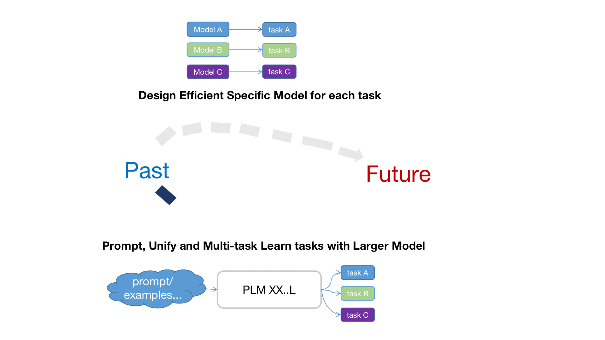

# Introduction to Structured Knowledge Grounding
{: .no_toc }

## Table of contents
{: .no_toc .text-delta .fs-4 style="font-weight:800"}

- TOC
{:toc}

---
## What is structured knowledge?
Structured knowledge(e.g., web tables, knowledge graphs, and databases) stores large amounts of data in an organized structure and forms a basis for a wide range of applications, e.g., medical records, personal assistants, and customer relations management. Accessing and searching data in structured knowledge typically requires query languages or professional training. 

## What is structured knowledge grounding?
To promote the efficiencyof data access, structured knowledge grounding(SKG) grounds user requests in structured knowledge and produces various outputs including computer programs(e.g., SQL and SPARQL),  cell values, and natural language responses(as shown below).

For example, semantic parsing converts natural language questions into formal programs; question answering derives answers from tables or knowledge graphs.

[comment]: <> (## How we study structured knowledge grounding&#40;Thoughts on directions&#41;)

[comment]: <> (It is widely believed that there is no "free lunch" in machine learning field, when model gets improved in some aspects, it loses its ability in other certain aspects implicitly or explicitly. Therefore the point is to find a proper trade-off.)

[comment]: <> (In 2022, it seems there are two trends forward: )

[comment]: <> (- One is more **distributed**, continue to explore more powerful and efficient models for each task. Sacrifies ability in generalization for better performance in field we focused.)

[comment]: <> (- The other is more **centralized**, which relies on one bigger model, aims to unify all tasks into it&#40;by ways of prompt-learning, in-context-learning etc.&#41;. It has stronger ability in generalization and zero/few shot scenario, but large in size.)

[comment]: <> ()

[comment]: <> (Each direction has its benefits and trade-off. UnifiedSKG framework can benefit each on sides, but more on the centralized way.)
