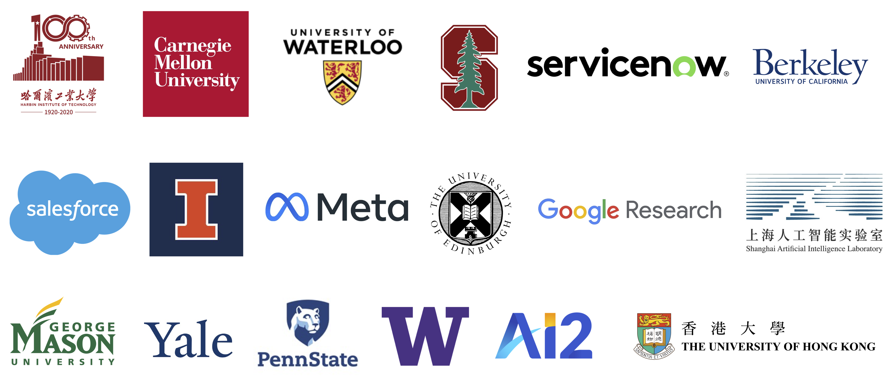

# Structured Knowledge Grounding(SKG) Resources Collections
{: .fs-7 .fw-700 .text-purple-300 }
In progress
{: .label .label-yellow }

## About
This website contains collection of datasets, publications that are related to *structured knowledge grounding* to facilitate researchers. **The website is in progress, so please don't hesitate to contact [us](mailto:tianbaoxiexxx@gmail.com) if we missed any other valuable work.**


### Content
{: .no_toc .text-delta .fs-4 style="font-weight:800"}

#### [Introduction](/introduction)
{: .no_toc .text-delta .fs-3 style="font-weight:600"}
<ul id="markdown-toc"> 
    <li><a href="/introduction#what-is-structured-knowledge/" id="markdown-toc-what-is-structured-knowledge">What is structured knowledge?</a></li> 
    <li><a href="/introduction#what-is-structured-knowledge-grounding" id="markdown-toc-what-is-structured-knowledge-grounding">What is structured knowledge grounding?</a></li>
</ul>

#### [Benchmarks Dataset](/benchmarks)
{: .no_toc .text-delta .fs-3 style="font-weight:600"}
<ul id="markdown-toc"> 
    <li><a href="/benchmarks#semantic-parsing" id="markdown-toc-semantic-parsing">Semantic Parsing</a></li> 
    <li><a href="/benchmarks#question-answering" id="markdown-toc-question-answering">Question Answering</a></li> 
    <li><a href="/benchmarks#data-to-text" id="markdown-toc-data-to-text">Data-to-Text</a></li> 
    <li><a href="/benchmarks#conversational" id="markdown-toc-conversational">Conversational</a></li> 
    <li><a href="/benchmarks#fact-verification" id="markdown-toc-fact-verification">Fact Verifications</a></li> 
    <li><a href="/benchmarks#formal-language-to-text" id="markdown-toc-formal-language-to-text">Formal-Language-to-Text</a></li> 
</ul>

[comment]: <> (    <li><a href="/benchmarks#other-related-datasets" id="markdown-toc-other-related-datasets">Other Related Datasets</a></li> )

#### [Methodology](/methodology)
{: .no_toc .text-delta .fs-3 style="font-weight:600"}

[comment]: <> (<ul id="markdown-toc"> )

[comment]: <> (    <li><a href="/methodology#structured-knowledge-encoding" id="markdown-toc-structured-knowledge-encoding">Structured Knowledge Encoding</a></li> )

[comment]: <> (    <li><a href="/methodology#pre-training" id="markdown-toc-pre-training">Pre-training</a></li>)

[comment]: <> (</ul>)

#### [Others](/others)
{: .no_toc .text-delta .fs-3 style="font-weight:600"}
<ul id="markdown-toc"> 
    <li><a href="/others#other-resources" id="markdown-toc-other-resources">Other Resources</a></li>
    <li><a href="/others#useful-links" id="markdown-toc-useful-links">Useful Links</a></li> 
</ul>

---

## Contribute
Contact [us](mailto:tianbaoxiexxx@gmail.com) or make pull request on [Github](https://github.com/HKUNLP/UnifiedSKGsite) to improve this portal site as editors.

## Organizations

<script type='text/javascript' id='clustrmaps' src='//cdn.clustrmaps.com/map_v2.js?cl=080808&w=300&t=m&d=lLOlCuZQy0Kh_M45EMrhU6iiFL4FlHcLWyCWLrcXJ7g&co=ffffff&ct=808080&cmo=3acc3a&cmn=ff5353'></script>
<!-- used for generating the html -->

## Citation
If you find our work helpful, please cite as
```
@article{UnifiedSKG,
      title={UnifiedSKG: Unifying and Multi-Tasking Structured Knowledge Grounding with Text-to-Text Language Models}, 
      author={Tianbao Xie and Chen Henry Wu and Peng Shi and Ruiqi Zhong and Torsten Scholak and Michihiro Yasunaga and Chien-Sheng Wu and Ming Zhong and Pengcheng Yin and Sida I. Wang and Victor Zhong and Bailin Wang and Chengzu Li and Connor Boyle and Ansong Ni and Ziyu Yao and Dragomir Radev and Caiming Xiong and Lingpeng Kong and Rui Zhang and Noah A. Smith and Luke Zettlemoyer and Tao Yu},
      journal={arXiv preprint arXiv:2201.05966},
      year={2022},
}
```
Also check out our UnifiedSKG framework [here](https://github.com/HKUNLP/UnifiedSKG)!