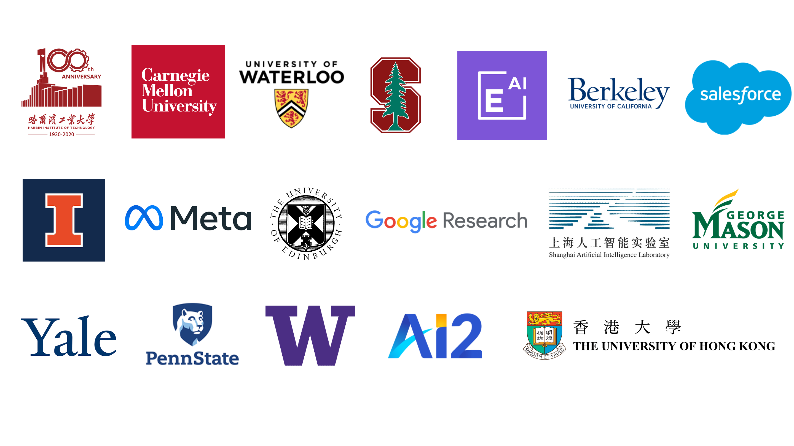

# UnifiedSKG.com - A Portal Site for Structured Knowledge Grounding(SKG) Resources
{: .fs-7 .fw-700 .text-blue-300 }

<table>
<tr><td markdown="block" class="fs-4">
--- ***An online compendium of Structured Knowledge Grounding(SKG) research***
</td></tr>

</table>
---

## What is this site for?
This portal site is here to provide easy access to a comprehensive collection of resources, datasets, publications that are related to *structured knowledge grounding*. 

### Table of contents
{: .no_toc .text-delta .fs-4 style="font-weight:800"}

#### [Introduction to Structured Knowledge Grounding](/intro)
{: .no_toc .text-delta .fs-3 style="font-weight:600"}
<ul id="markdown-toc"> <li><a href="intro#what-is-structured-knowledge/" id="markdown-toc-what-is-structured-knowledge">What is structured knowledge?</a></li> <li><a href="/intro#what-is-structured-knowledge-grounding" id="markdown-toc-what-is-structured-knowledge-grounding">What is structured knowledge grounding?</a></li></ul>

#### [Knowledge Resources for Structured Knowledge Grounding](/resources)
{: .no_toc .text-delta .fs-3 style="font-weight:600"}

#### [Benchmark Datasets for Structured Knowledge Grounding](/datasets)
{: .no_toc .text-delta .fs-3 style="font-weight:600"}
<ul id="markdown-toc"> <li><a href="/datasets#semantic-parsing-tasks" id="markdown-toc-semantic-parsing-tasks">Semantic Parsing Tasks</a></li> <li><a href="/datasets#question-answering" id="markdown-toc-question-answering">Question Answering</a></li> <li><a href="/datasets#data-to-text" id="markdown-toc-data-to-text">Data-to-Text</a></li> <li><a href="/datasets#conversational" id="markdown-toc-conversational">Conversational</a></li> <li><a href="/datasets#fact-verification" id="markdown-toc-fact-verification">Fact Verifications</a></li> <li><a href="/datasets#formal-language-to-text" id="markdown-toc-formal-language-to-text">Formal-Language-to-Text</a></li> <li><a href="/datasets#other-related-datasets" id="markdown-toc-other-related-datasets">Other Related Datasets</a></li> </ul>

#### [Methods to Structured Knowledge Grounding](/methods)
{: .no_toc .text-delta .fs-3 style="font-weight:600"}
<ul id="markdown-toc"> <li><a href="/methods#linearized-and-concat" id="markdown-toc-linearized-and-concat">Linearize and Concat</a></li> <li><a href="/methods#manipulating-transformers" id="markdown-toc-manipulating-transformers">Manipulating Transformers</a></li> <li><a href="/methods#hierarchical-encoding" id="markdown-toc-hierarchical-encoding">Hierarchical Encoding</a></li> <li><a href="/methods#convert2nl" id="markdown-toc-convert2nl">Convert2NL</a></li> <li><a href="/methods#others" id="markdown-toc-others">Others</a></li> </ul>

#### [Inspiring Topics about Structured Knowledge Grounding](/analysis)
{: .no_toc .text-delta .fs-3 style="font-weight:600"}
<ul id="markdown-toc"> <li><a href="analysis#multi-task-learning" id="markdown-toc-multi-task-learning">Multi-task learning</a></li> <li><a href="analysis#prompt-learning" id="markdown-toc-prompt-learning">Prompt learning</a></li> <li><a href="analysis#calibration" id="markdown-toc-calibration">Calibration</a></li> <li><a href="analysis#few-shot-learning" id="markdown-toc-few-shot-learning">Few Shot Learning</a></li> <li><a href="analysis#task-unification" id="markdown-toc-task-unification">Task Unification</a></li> <li><a href="analysis#pre-training" id="markdown-toc-pre-training">Pre-training</a></li> <li><a href="analysis#explainable-ai" id="markdown-toc-explainable-ai">Explainable AI</a></li> <li><a href="analysis#analysis" id="markdown-toc-analysis">Analysis</a></li> <li><a href="analysis#others" id="markdown-toc-others">Others</a></li></ul>

#### [Additional materials](/misc)
{: .no_toc .text-delta .fs-3 style="font-weight:600"}
<ul id="markdown-toc"> <li><a href="/misc#surveys--position-papers" id="markdown-toc-surveys--position-papers">Surveys &amp; Position Papers</a></li> <li><a href="/misc#tutorials-and-talks" id="markdown-toc-tutorials-and-talks">Tutorials and Talks</a></li> <li><a href="/misc#articles" id="markdown-toc-articles">Articles</a></li> <li><a href="/misc#workshops" id="markdown-toc-workshops">Workshops</a></li> <li><a href="/misc#books" id="markdown-toc-books">Books</a></li> <li><a href="/misc#useful-links" id="markdown-toc-useful-links">Useful links</a></li> <li><a href="/misc#blogs" id="markdown-toc-blogs">Blogs</a></li> </ul>

---

## How can I contribute?
This site needs your help to grow! 
Join us on Github to improve this portal site as editors. We also have a Slack workspace to collect suggestions for this site and to connect people working on structured knowledge grounding. Feel free to just drop in and say hi! :)

[Github](https://github.com/HKUNLP/UnifiedSKGsite){: .btn .btn-green .mr-2 target="_blank" .fs-3 }

## Organizations

<!-- used for generating the html -->